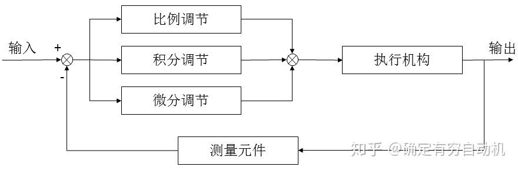
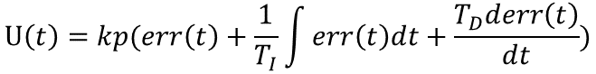

# PID 控制算法
**閉環控制的一種**

PID (proportion integration differentiation)==**比例**, **积分**, **微分控制**

## :smile: Proportion 比例控制

通過參數`Kp`構建`u`與`error`之間的線性關係
$$
U(t) = kp*error(t)
$$
**缺點:** 容易出現穩態誤差

## :laugh: Integration 積分控制

通過參數`Ki`構建`u`與$\int$ error之間的線性關係
$$
U(t) = ki*\int error(t)dt
$$
可以解決穩態誤差的問題

## :anger: Differentiation 微分控制
考虑刹车情况。平稳的驾驶车辆，当发现前面有红灯时，为了使得行车平稳，基本上提前几十米就放松油门并踩刹车了。当车辆离停车线非常近的时候，则使劲踩刹车，使车辆停下来。整个过程可以看做一个加入微分的控制策略。

-----------**目的是爲了避免剎車不到位而超過停車顯**-----------

通過參數`Kd`構建`u`與`derror`之間的線性關係
$$
U(t)=ki*d(error(t)) 
$$
**注意**: 這裏的derror一定是負的,
也就是說kd的作用就是**使error震盪減少**

## Conclusion
|||
|--------|--------|
|控制方式|作用|
|Proportion|增加穩定速度|
|Ingegration|提高平衡位置,避免穩態誤差|
|Differentiation|增加穩定性,減少穩定波動|

## 

在真正的工程实践中，**最难的是如果确定三个项的系数，这就需要大量的实验以及经验来决定了**。通过不断的尝试和正确的思考，就能选取合适的系数，实现优良的控制器。