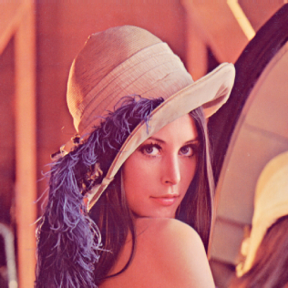
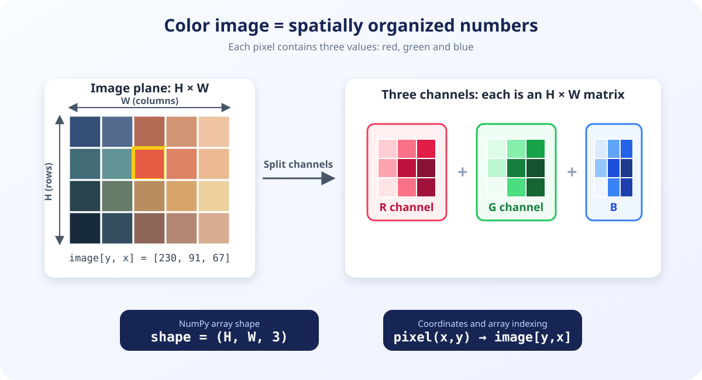
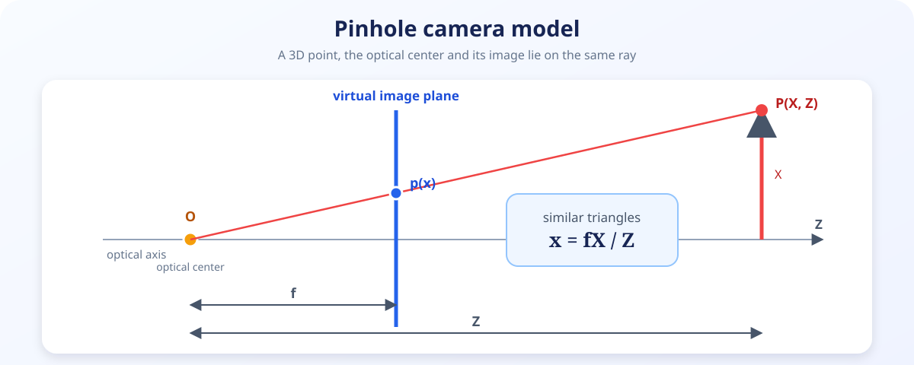
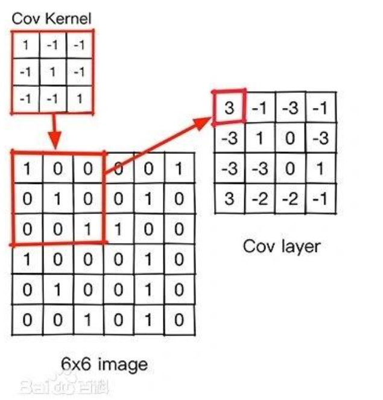
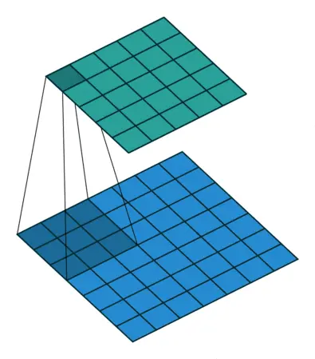

# 🤖 南科大 ARES 算法培训：计算机视觉基础

> 讲解人：冯杰楠

## 👋 写在前面

人类可以很轻松地看出图像中有什么，判断物体在哪里、离我们有多远，还能从不同角度的画面中认出同一个物体。但对计算机来说，一张图像首先只是一组排列整齐的数值。**计算机视觉**（Computer Vision，CV）要做的，就是让计算机从这些数值中提取有用信息，进而理解图像和三维世界。

计算机视觉涉及数字图像处理、线性代数、几何学、概率统计、优化方法和深度学习等许多内容。一次短时间的培训不可能覆盖完整的理论和算法，也不需要一开始就记住大量公式。

这部分内容是一次 **introduction**：我们会先看看图像在计算机中如何表示，再了解三维世界如何通过相机投影成二维图像，然后从局部像素之间的关系出发，认识卷积、滤波和图像梯度。这些概念既是传统图像处理的基础，也能帮助我们理解 CNN 为什么能够从图像中学习特征。

听完后不需要独立推导复杂的多视图几何，也不需要立即实现一套完整的视觉系统。如果你能够：

1. 知道彩色图像、灰度图像和像素数值在计算机中如何表示；
2. 对相机将三维点投影到二维画面的过程有一个基本认识；
3. 理解卷积核如何在图像上滑动，以及它与模糊、锐化和边缘检测的关系；
4. 能够把图像、相机、特征和后续视觉任务放进一张大致的知识地图中；
5. 知道如果想继续学习，还需要补充哪些数学、编程和实践知识；

那么这次培训的目的就达到了。

> 从现实世界到一张图像，再从像素到可被识别的特征，就是本次培训的主线。

## 📚 延伸学习

> 🎓 **推荐完整课程：** [Photogrammetry I & II (University of Bonn)](https://www.ipb.uni-bonn.de/photo12-2021/index.html)。课程系统讲解了相机模型、标定、特征提取、多视图几何与三维重建等内容，适合在本次入门培训后继续学习。

> 🎬 **推荐视频课程：** [OpenCV 图像处理全套教程（唐宇迪）](https://www.bilibili.com/video/BV14A411C7ZE/)。课程从图像基本操作讲到滤波、梯度、Harris 角点、SIFT 特征和全景图像拼接，适合配合 OpenCV 代码进行实践。

> 📖 **官方教程：** [OpenCV-Python Tutorials](https://docs.opencv.org/4.x/d6/d00/tutorial_py_root.html)。官方文档按主题整理了图像读写、基本操作、图像处理、特征检测、视频分析和相机标定等 Python 示例，适合实验时按需查阅。

## 🖼️ 什么是图像？

### 1. 像素与图像坐标

**像素**（Pixel）是数字图像的基本单元。每个像素都有自己的位置和数值：位置告诉我们它在画面的哪里，数值则描述该位置的灰度或颜色。

图像坐标系通常以左上角为原点：

```text
(0, 0) ───────→ x 或 u（列）
  │
  │             pixel(x, y)
  │
  ↓ y 或 v（行）
```

一张宽度为 $W$、高度为 $H$ 的图像共有 $W\times H$ 个像素。需要特别注意：我们描述坐标时常写 $(x,y)$。

常见的 8 位图像使用 `uint8` 存储，每个数值的范围是 $0\sim255$，一共 $2^8=256$ 种可能。在深度学习中，这些数值还经常被转换为浮点数并归一化到 $0\sim1$。



<p style="color: #888; font-size: 0.9em;">📎 <strong>一点小历史：</strong>上图名为 <a href="https://en.wikipedia.org/wiki/Lenna">Lenna</a>，裁剪自瑞典模特 Lena Forsén 在 1972 年 11 月《Playboy》杂志中的一幅照片。它从 1973 年起被用于数字图像处理研究，后来逐渐成为经典测试图；但它的来源与对女性的呈现也引发了长期争议，<a href="https://sipi.usc.edu/database/database.php?volume=misc&amp;image=12">USC-SIPI 图像数据库</a>现已停止分发该图。这里主要用它观察像素、矩阵和颜色通道。</p>

> 🧪 **演示程序：** [01_image_structure.py](demos/01_image_structure.py) 会打印图像的 `shape`、`dtype` 和像素值，并放大展示局部像素网格。

### 2. RGB 彩色图像：三张矩阵叠在一起

彩色显示器通过红（Red）、绿（Green）、蓝（Blue）三种光的不同组合产生颜色。因此，RGB 图像中的每个像素不再是一个数，而是一个由三个数组成的向量：

$$
I(x,y)=\begin{bmatrix}R(x,y) & G(x,y) & B(x,y)\end{bmatrix}
$$

对于 8 位 RGB 图像：

- $(255,0,0)$ 表示红色；
- $(0,255,0)$ 表示绿色；
- $(0,0,255)$ 表示蓝色；
- $(0,0,0)$ 表示黑色；
- $(255,255,255)$ 表示白色。

宽为 $W$、高为 $H$ 的 RGB 图像可以用形状为 $H\times W\times3$ 的三阶数组表示。它也可以看成 R、G、B 三张大小相同的灰度图叠在一起，每一张都称为一个**通道**（Channel）。



> ⚠️ OpenCV 的 `cv2.imread()` 默认按 **BGR** 而不是 RGB 的顺序读取彩色图像。直接使用 Matplotlib 显示时，红色和蓝色会被交换，需要先进行颜色转换。

> 🧪 **演示程序：** [02_rgb_channels.py](demos/02_rgb_channels.py) 会拆分并分别显示红、绿、蓝三个通道。

### 3. 灰度图：每个像素只保留一个强度

**灰度图**（Grayscale Image）中的每个像素只有一个数值。在 8 位灰度图中，$0$ 表示黑色，$255$ 表示白色，中间的数值表示不同程度的灰色。因此，一张灰度图是形状为 $H\times W$ 的二阶数组。

将 RGB 图像转换为灰度图时，通常不是简单取三个通道的平均值，而是根据人眼对不同颜色的敏感程度进行加权。一个常见的近似是：

$$
Y=0.299R+0.587G+0.114B
$$

灰度化会丢失颜色信息，但能减少数据量，并使边缘检测、角点提取和二值化等许多操作更简单。

> 🧪 **演示程序：** [03_grayscale.py](demos/03_grayscale.py) 会对比简单平均、加权公式和 OpenCV 得到的灰度图。

### 4. 二值图：每个像素只有两种状态

**二值图**（Binary Image）中的像素只有两种可能的取值，逻辑上可以表示为 $0$ 和 $1$，保存或显示时则经常使用 $0$ 和 $255$。

最简单的生成方法是对灰度图设置一个阈值 $T$：

$$
B(x,y)=
\begin{cases}
255, & I(x,y)\ge T \\
0, & I(x,y)<T
\end{cases}
$$

这个过程叫作**二值化**（Binarization）或阈值分割。二值图常用来表示“目标/背景”、“通过/不通过”或其他两种状态，例如文档扫描、缺陷检测和分割掩码。

阈值过低会把大量背景判为目标，阈值过高则可能丢失目标。因此，二值化效果不仅取决于阈值，还会受光照、阴影、噪声和目标颜色的影响。Otsu 等方法可以根据图像的灰度分布自动选择阈值。

> 💡 日常语言中的“黑白照片”通常其实是包含许多级明暗的**灰度图**；严格的**二值图**只有黑和白两种取值。

> 🧪 **演示程序：** [04_binarization.py](demos/04_binarization.py) 会对比三个固定阈值，并展示 Otsu 自动选择的阈值。

### 5. 把三种图像放在一起

| 图像类型 | 数组形状 | 单个像素 | 保留的信息 |
|---|---|---|---|
| RGB 彩色图 | $H\times W\times3$ | $(R,G,B)$ | 颜色与明暗 |
| 灰度图 | $H\times W$ | 一个强度值 | 明暗 |
| 二值图 | $H\times W$ | $0/1$ 或 $0/255$ | 两种状态 |

从彩色图到灰度图，再到二值图，图像中的信息逐步减少，但数据也变得更容易处理。应该使用哪一种表示，取决于我们想要解决的问题。

### 运行演示

进入 `CV` 目录后，可以单独运行任意一个演示：

```bash
python3 demos/01_image_structure.py
python3 demos/02_rgb_channels.py
python3 demos/03_grayscale.py
python3 demos/04_binarization.py
```

## 📷 从三维世界到二维图像

一张照片是二维的，但我们生活的世界是三维的。相机成像要回答的核心问题就是：

> 现实世界中的一个点，最后会落在照片的哪一个位置？

### 1. 针孔相机：光线穿过一个小孔

先想象一个完全不透光的盒子，一侧只开一个很小的孔。物体反射的光线穿过小孔后，会在盒子另一侧形成图像。这就是**针孔相机模型**（Pinhole Camera Model）的基本思想。

模型做了一个理想化假设：所有光线都经过同一个无限小的小孔，也就是**相机光心**。因此，空间中的点、相机光心和它在图像上的投影点位于同一条直线上。



<p style="color: #888; font-size: 0.9em;">真实针孔相机的成像平面在光心后方，得到的像会上下颠倒。为了更容易画图和计算，计算机视觉中通常在光心前方放置一个虚拟成像平面，上图使用的就是这种画法。</p>

由相似三角形可以得到一个很直观的比例关系：

$$
\frac{\text{图像中的大小}}{\text{物体的真实大小}}
=
\frac{\text{焦距}}{\text{物体到相机的距离}}
$$

这个比例已经包含了针孔成像最重要的现象：

- 物体离相机越远，在图像中越小，也就是**近大远小**；
- 焦距越大，物体在图像中越大，能看到的视野通常越窄；
- 位于同一条观测光线上的多个点，可能投影到图像中的同一个位置。

如果用 $X,Y$ 表示点偏离光轴的距离，$Z$ 表示点到相机的深度，$f$ 表示焦距，这个比例可以简写为：

$$
x=f\frac{X}{Z},\qquad y=f\frac{Y}{Z}
$$

公式不需要死记，只需要看出：$x,y$ 与焦距 $f$ 成正比，与深度 $Z$ 成反比。

> 🧪 **动手试一试：** [05_pinhole_camera.py](demos/05_pinhole_camera.py) 会将一个三维立方体投影到二维图像。拖动焦距和深度滑块，可以直接观察上面的比例关系。

```bash
python3 demos/05_pinhole_camera.py
```

### 2. 同一个点的三种描述

坐标系可以理解为不同观察者使用的不同“尺子”。例如，要描述教室中一名同学的位置：

- 从教室门口开始测量，得到的是他在教室中的位置；
- 从相机开始测量，得到的是他相对于相机的位置；
- 在拍到的照片上测量，得到的是他出现在第几列、第几行。

同一个人并没有移动，只是我们更换了描述位置的方式：

| 坐标 | 它回答的问题 |
|---|---|
| **世界坐标** | 点在现实场景中的哪里？ |
| **相机坐标** | 从相机看，点在哪个方向、有多远？ |
| **像素坐标** | 点最后出现在图像的哪一列、哪一行？ |

因此，相机投影可以先理解成：

```text
点在现实世界的哪里
→ 点相对于相机在哪里
→ 进行近大远小的针孔投影
→ 换算成图像中的行和列
```

### 3. 内参与外参：相机自身与相机位置

将三维点变成像素坐标时，需要知道两类信息：

| 参数 | 直观问题 | 常见内容 |
|---|---|---|
| **外参**（Extrinsics） | 相机放在哪里，朝向哪里？ | 相机的位置与旋转 |
| **内参**（Intrinsics） | 这台相机怎样把画面换算成像素？ | 焦距、主点和像素尺度 |

外参负责把“点在世界中哪里”换成“点相对于相机在哪里”。数学上常用旋转 $R$ 和平移 $t$ 表示，入门阶段只需记住：

> **外参描述相机在世界中的位置和朝向。**

内参负责将理想成像位置换成真正的像素行列。其中最重要的是：

- $f_x,f_y$：用像素表示的水平和垂直焦距，控制画面的缩放；
- $(c_x,c_y)$：**主点**（Principal Point），表示光轴与成像平面的交点，通常接近图像中心。

> **内参描述相机自身怎样将光线换算成像素。**

镜头上标注的焦距常以毫米为单位，而 $f_x,f_y$ 以像素为单位。二者还需要根据传感器或像素的实际尺寸进行换算。

### 4. 理想的小孔与真实的镜头

针孔模型很简洁，但真实相机不是只有一个小孔，而是通过镜头组折射光线。镜头会带来针孔模型没有描述的畸变：

- **径向畸变**：图像中的直线向外或向内弯曲，常见的是桶形和枕形畸变；
- **切向畸变**：镜头与传感器没有完全平行等装配误差导致的偏移。

**相机标定**（Camera Calibration）就是通过拍摄已知几何结构的标定板，估计相机的内参和畸变参数。知道这些参数后，才能更准确地建立三维光线与二维像素之间的关系。

### 5. 为什么一张图像会丢失深度？

从一个像素出发，穿过相机光心，可以向现实世界中画出一条观测射线。只要三维点位于这条射线上，它们都会投影到同一个像素。

因此，一张图像通常只能告诉我们“点在哪个方向”，却不能单独告诉我们“点沿这个方向有多远”。如果从另一个位置再观察一次，两条观测射线就可以帮助我们确定三维点的位置。这就自然引出了后面的**多视图几何**。

<details>
<summary><strong>📐 选学：齐次坐标与完整投影公式</strong></summary>

如果已经学过矩阵，可以继续阅读这一部分；没有学过也不影响理解前面的针孔模型。

**齐次坐标**（Homogeneous Coordinates）会在普通坐标后增加一个辅助数字，例如把三维点 $(X,Y,Z)$ 写成 $(X,Y,Z,1)$。这样旋转、平移和投影就可以统一写成矩阵运算。

相机内参可以组成矩阵：

$$
K=
\begin{bmatrix}
f_x&0&c_x\\
0&f_y&c_y\\
0&0&1
\end{bmatrix}
$$

世界坐标到相机坐标的旋转和平移用 $R,t$ 表示。完整投影可以压缩写成：

$$
\tilde p\sim K[R\mid t]\tilde P_w
$$

从左到右，这个公式仍然只是前面的三步：

```text
世界中的三维点
→ 用 R,t 换成相机视角
→ 进行针孔透视投影
→ 用 K 换算成像素坐标
```

这里不要求记忆或计算，只需要知道：齐次坐标让计算机可以把多个几何步骤整齐地合并在一起。

</details>

## 🪟 卷积：用一个小窗口观察图像

相机将现实世界记录成像素，但单独查看一个像素，很难判断它属于平坦区域、边缘还是纹理。这些结构都由**附近多个像素之间的关系**共同决定。

因此，我们可以用一个小窗口在图像上从左到右、从上到下滑动，每到一个位置，就对窗口内的像素做一次相同的计算。这个小窗口中的数值称为**卷积核**（Kernel）或**滤波器**（Filter）。

<div style="display: flex; justify-content: center; align-items: center; gap: 24px; flex-wrap: nowrap;">
  
  
</div>

除了把卷积核看成一个“局部计算窗口”，还可以把它理解成一张**特征比对卡**：卷积核中的数值描述了它想要寻找的局部明暗排列。它在图像上不断滑动，每到一个位置，就将当前图像块与这张“卡”进行一次比对。

以一个寻找竖直边缘的核为例：

$$
K=
\begin{bmatrix}
-1&0&1\\
-1&0&1\\
-1&0&1
\end{bmatrix}
$$

- 当局部图像左暗右亮时，它与卷积核的排列方式相符，会得到较大的**正响应**；
- 当局部图像左亮右暗时，方向与卷积核相反，会得到绝对值较大的**负响应**；
- 当局部区域的亮度基本相同时，正负项会相互抵消，输出接近 $0$。

> **滑动窗口说明卷积“怎样算”，特征比对卡说明卷积“在找什么”。**

这种理解对边缘、方向和纹理检测尤其直观。平均滤波和高斯滤波更像是对局部信息进行汇总，不必强行解释为寻找某种形状。在 CNN 中，网络则会自动学习许多张对当前任务有用的“特征比对卡”。

在每个位置，计算可以分为三步：

1. 取出卷积核覆盖的局部图像；
2. 将局部像素与卷积核中对应的数值相乘；
3. 把所有乘积相加，作为输出图像中的一个新像素。

以 $3\times3$ 卷积核为例，这个过程可以简写为：

$$
O(y,x)=\sum_i\sum_j K(i,j)I(y+i,x+j)
$$

这里不需要背公式，只要记住：

> **局部像素与核逐个相乘，然后全部相加，得到一个新像素。**

卷积核滑动时还会遇到两个简单问题：

- **步长**（Stride）：卷积核每次移动多少个像素；
- **填充**（Padding）：图像边缘外没有像素，可以在周围补充数值，使输出尺寸不至于变小。

<p style="color: #888; font-size: 0.9em;">💡 严格的数学卷积会先将核翻转，而 OpenCV 的 <code>filter2D</code> 和大多数 CNN 实现直接使用不翻转的互相关运算。在计算机视觉的日常语境中，两者经常都被简称为“卷积”。</p>

> 🧪 **动手试一试：** [06_convolution.py](demos/06_convolution.py) 使用一个 $3\times3$ 核扫描 $5\times5$ 数值图像。拖动滑块可以观察每个输出像素来自哪个局部窗口。

```bash
python3 demos/06_convolution.py
```

## 🎛️ 滤波：让卷积核完成不同任务

卷积说明了“怎样计算”，卷积核中的数值则决定“计算会得到什么”。改变卷积核，就可以对图像进行平滑、锐化或特定方向的变化检测。这类根据像素邻域改变图像的操作统称为**滤波**（Filtering）。

### 1. 平均滤波：用附近像素的平均值代替当前像素

$$
K_{\text{mean}}=\frac{1}{9}
\begin{bmatrix}
1&1&1\\
1&1&1\\
1&1&1
\end{bmatrix}
$$

平均滤波会减少局部的剧烈变化，因此可以抑制一部分噪声，但也会让边缘和细节变得模糊。

### 2. 高斯滤波：距离中心越近，权重越大

$$
K_{\text{Gaussian}}=\frac{1}{16}
\begin{bmatrix}
1&2&1\\
2&4&2\\
1&2&1
\end{bmatrix}
$$

高斯滤波不再平等对待窗口内的所有像素，而是让距离中心越近的像素影响越大。它是图像去噪和边缘检测前常用的平滑方法。

### 3. 中值滤波：取邻域中排在中间的数

中值滤波会对窗口内的像素排序，用中位数代替当前像素。它不是线性卷积，但对随机出现的黑白亮点，也就是**椒盐噪声**，通常非常有效。

### 4. 锐化：强调中心像素与周围的差异

$$
K_{\text{sharp}}=
\begin{bmatrix}
0&-1&0\\
-1&5&-1\\
0&-1&0
\end{bmatrix}
$$

锐化会强调局部明暗变化，让边缘看起来更清晰。但噪声本身也是剧烈的局部变化，因此过度锐化也会同时放大噪声。

| 方法 | 核心思路 | 常见效果 |
|---|---|---|
| 平均滤波 | 局部取平均 | 简单模糊，细节损失较明显 |
| 高斯滤波 | 中心附近权重更大 | 较自然地平滑与去噪 |
| 中值滤波 | 局部取中位数 | 去除椒盐噪声 |
| 锐化 | 强调局部差异 | 增强边缘，也可能放大噪声 |

> 🧪 **动手试一试：** [07_filters.py](demos/07_filters.py) 会为图像加入噪声，并对比平均、高斯、中值和锐化的效果。

```bash
python3 demos/07_filters.py
```

## 📈 图像梯度：寻找亮度变化最剧烈的位置

一条物体边缘的两侧往往具有不同的亮度或颜色。因此，与其直接寻找“边缘”，不如先寻找**像素变化快的地方**。

考虑一行灰度值：

```text
40, 42, 45, 47, 198, 202, 203
```

相邻像素之间的差值大致是：

```text
  2,  3,  2, 151,   4,   1
```

在 $47$ 到 $198$ 之间出现了很大的变化，这里就可能存在一条边缘。**图像梯度**（Image Gradient）就是对这种亮度变化速度和方向的描述。

### 1. 水平梯度与垂直梯度

二维图像中的亮度可能沿水平或垂直方向变化，因此通常分别计算：

- $G_x$：图像沿 $x$ 方向（左右）的变化；
- $G_y$：图像沿 $y$ 方向（上下）的变化。

Sobel 算子使用两个小核，在估计差分的同时对另一方向做少量平滑：

$$
G_x=
\begin{bmatrix}
-1&0&1\\
-2&0&2\\
-1&0&1
\end{bmatrix},\qquad
G_y=
\begin{bmatrix}
-1&-2&-1\\
0&0&0\\
1&2&1
\end{bmatrix}
$$

例如，$G_x$ 会比较窗口左右两侧的亮度。左右差异越大，响应越强，因此它容易检测到**竖直边缘**。同理，$G_y$ 容易检测到水平边缘。

### 2. 梯度幅值与方向

将两个方向的变化合并，可以得到梯度的强度和方向：

$$
G=\sqrt{G_x^2+G_y^2},\qquad
\theta=\operatorname{atan2}(G_y,G_x)
$$

- $G$ 越大，说明该位置的亮度变化越剧烈；
- $\theta$ 指向亮度增长最快的方向，它通常与边缘方向垂直。

需要注意，强梯度不一定就是物体边界：纹理、阴影和噪声也会产生剧烈的像素变化。因此，边缘检测前常先使用高斯滤波抑制噪声。

### 3. 从梯度到 Canny 边缘

Canny 边缘检测将多个步骤组合在一起：

```text
高斯平滑 → 计算梯度 → 细化边缘 → 使用高低阈值连接可靠边缘
```

它的输出不是“已经认出的物体”，而是图像中较稳定的强变化位置。

> 🧪 **动手试一试：** [08_gradients.py](demos/08_gradients.py) 会对比水平 Sobel、垂直 Sobel、梯度幅值和 Canny 边缘。

```bash
python3 demos/08_gradients.py
```

## 📍 角点与局部特征：找到可以重复定位的位置

梯度可以告诉我们哪里发生了明显变化，但一条边缘上有许多看起来很相似的位置。如果想在另一张图像中再次找到同一个地方，我们更希望选择容易准确定位的点。

### 1. 平坦区域、边缘与角点

可以想象在图像上放置一个小窗口，然后将它向不同方向移动：

- **平坦区域**：窗口向任何方向移动，里面的像素都变化不大；
- **边缘**：沿边缘方向移动时变化不大，垂直边缘移动时变化明显；
- **角点**：向任何方向移动，窗口内容都会明显变化。

因此，角点在水平和垂直方向上通常都有较强的梯度，比平坦区域和单独边缘更容易稳定定位。

**Harris 角点检测**就是根据“窗口向各个方向移动时变化有多大”来寻找角点。入门阶段不需要推导它的矩阵和特征值，只需要记住这个窗口移动的直觉。

### 2. SIFT：不仅找到点，还要描述它

只知道关键点在哪里还不够。要在另一张图像中找到它，还需要把关键点周围的局部外观记录下来。

SIFT（Scale-Invariant Feature Transform）大致会为每个局部特征产生两部分信息：

- **关键点**（Keypoint）：位置、尺度和主要方向；
- **描述子**（Descriptor）：一个描述关键点附近梯度分布的数字向量。

描述子可以理解成关键点的“局部身份证”。当图像发生一定程度的缩放、旋转、亮度变化或视角变化时，SIFT 仍然有机会再次找到对应的局部结构。

| 概念 | 回答的问题 |
|---|---|
| 角点/关键点 | 图像中哪些位置值得关注？ |
| 描述子 | 怎样用数字描述这个位置附近的外观？ |

> 🧪 **动手试一试：** [09_keypoints.py](demos/09_keypoints.py) 会在同一张图上对比 Harris 角点和 SIFT 关键点。SIFT 圆的大小表示尺度，线的方向表示关键点的主方向。

```bash
python3 demos/09_keypoints.py
```

## 🔗 特征点匹配：在两张图中寻找同一个地方

两张图像分别提取关键点和描述子后，就可以比较描述子之间的距离：距离越小，两个局部区域越相似。

最简单的做法是为图像 A 中的每个描述子，在图像 B 中找到距离最近的描述子。但重复纹理、模糊和遮挡都可能产生错误匹配，因此还需要逐步筛选：

```text
两张图像
→ 提取 SIFT 关键点和描述子
→ 寻找最相似的描述子
→ 比例检验排除模棱两可的匹配
→ RANSAC 排除不符合整体几何关系的外点
→ 得到较可靠的对应点
```

- **比例检验**：如果第一候选仅比第二候选好一点点，说明这个匹配不够唯一；
- **RANSAC**：反复从匹配中抽取少量样本建立几何模型，保留支持同一模型的多数匹配。

特征匹配是全景图像拼接、相机位姿估计、三维重建、视觉里程计和 SLAM 的重要基础。它将前面的梯度与局部特征，真正连接到了多视图几何。

> 🧪 **动手试一试：** [10_feature_matching.py](demos/10_feature_matching.py) 会从 Lenna 生成一个带透视变化的新视角，然后使用 SIFT、比例检验和 RANSAC 寻找可靠匹配。

```bash
python3 demos/10_feature_matching.py
```

## 🎯 YOLO：让模型找到并识别物体

角点、SIFT 和特征匹配可以找到稳定的局部结构，却不会告诉我们“这是一个人”或“这是一辆车”。如果要得到物体类别，就需要从大量带标注的数据中学习**语义特征**。

在传统图像处理中，平滑核、锐化核和 Sobel 核都是人工设计的。CNN 也使用局部滑动窗口，但卷积核中的数值会通过训练数据和反向传播自动学习。

```text
传统图像处理：人工设计特征比对卡 → 提取预先规定的特征
CNN：             从数据中学习比对卡 → 提取对当前任务有用的特征
```

YOLO（You Only Look Once）是一系列常用的**目标检测**模型。目标检测不仅要判断图像中有什么，还要找到它在哪里。

| 输出 | 含义 |
|---|---|
| **Bounding Box** | 物体在图像中的矩形位置 |
| **Class** | 模型认为物体属于哪个类别 |
| **Confidence** | 模型对当前检测的确定程度 |

模型对同一个物体可能给出多个重叠候选框。NMS（Non-Maximum Suppression，非极大值抑制）会保留置信度较高的框，并删除与它高度重叠的重复框。

```text
摄像头画面
→ CNN 提取特征
→ 预测物体位置、类别和置信度
→ NMS 去除重复框
→ 显示最终检测结果
```

YOLO 的检测结果非常直观，但它并不等于真正“理解”了物体。遮挡、奇怪角度、强光、过小的目标和训练数据中少见的场景，都可能让模型漏检或误检。

> 🧪 **实时演示：** [11_yolo_webcam.py](demos/11_yolo_webcam.py) 使用轻量 YOLO 模型检测摄像头画面。按 `Q` 或 `Esc` 退出。

```bash
python3 demos/11_yolo_webcam.py
```

也可以检测图片或视频：

```bash
python3 demos/11_yolo_webcam.py --source path/to/image.jpg
python3 demos/11_yolo_webcam.py --source path/to/video.mp4
```

<p style="color: #888; font-size: 0.9em;">💡 演示使用 Ultralytics 的 <code>yolo26n.pt</code> 小型预训练模型。权重已在 CV 目录中预先准备，现场可以离线运行；如果权重文件缺失，Ultralytics 会在首次运行时自动下载。完整参数说明见 <a href="https://docs.ultralytics.com/modes/predict/">Ultralytics 官方 Predict 文档</a>。</p>

## 🎯 总结：从像素到语义

现在可以把整次培训放回一条主线：

```text
现实世界
→ 相机投影与采样
→ RGB、灰度和二值图像
→ 卷积与滤波
→ 梯度、边缘与角点
→ SIFT 局部特征与两图匹配
→ 多视图几何与三维结构
→ CNN 与 YOLO 学习语义特征
```

传统方法和深度学习不是必须二选一的两条道路。梯度、特征匹配和几何约束擅长提供明确的空间关系，深度学习擅长从数据中学习复杂语义。真实视觉系统经常会同时使用两者。
