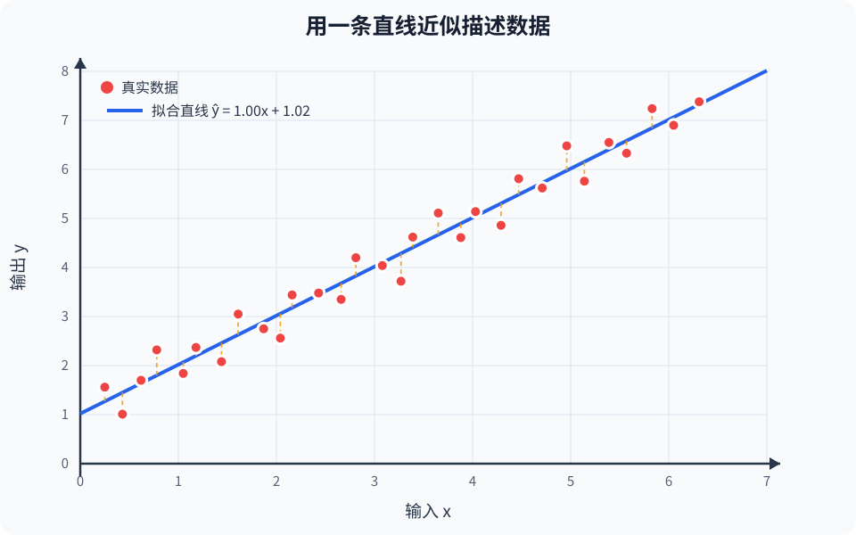
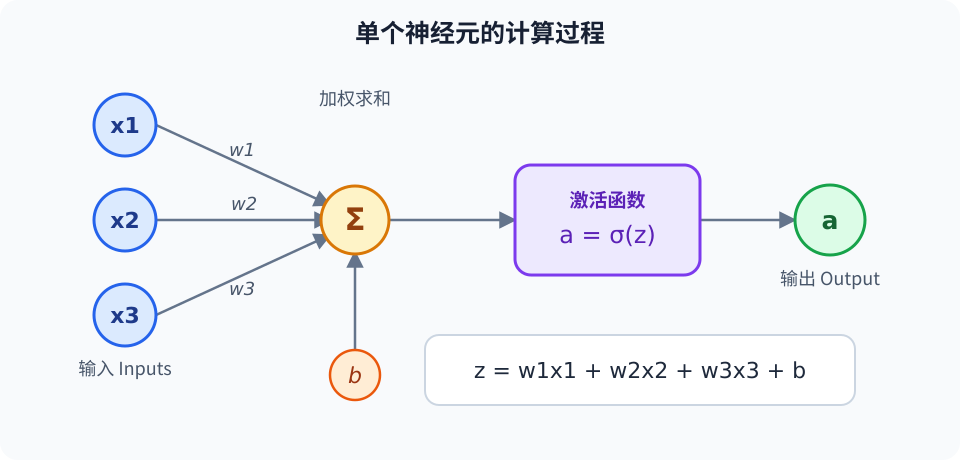
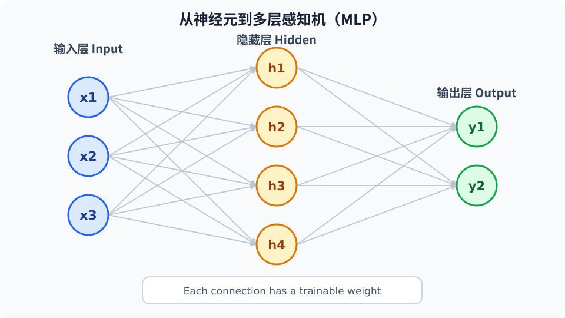
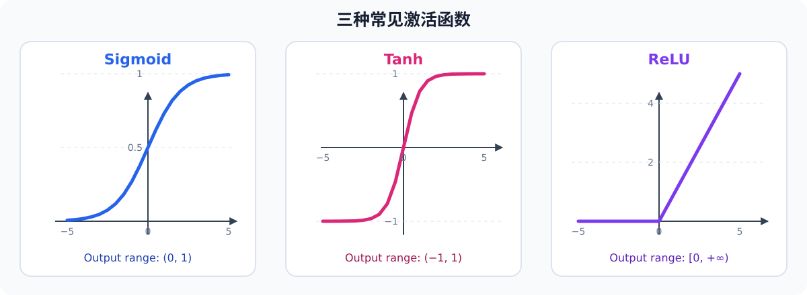
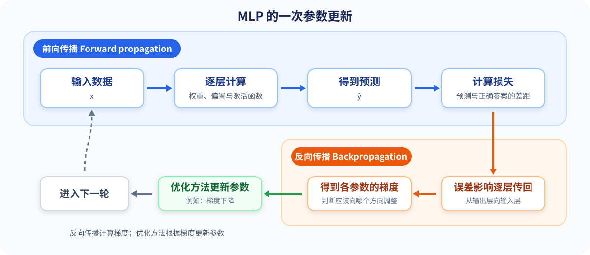
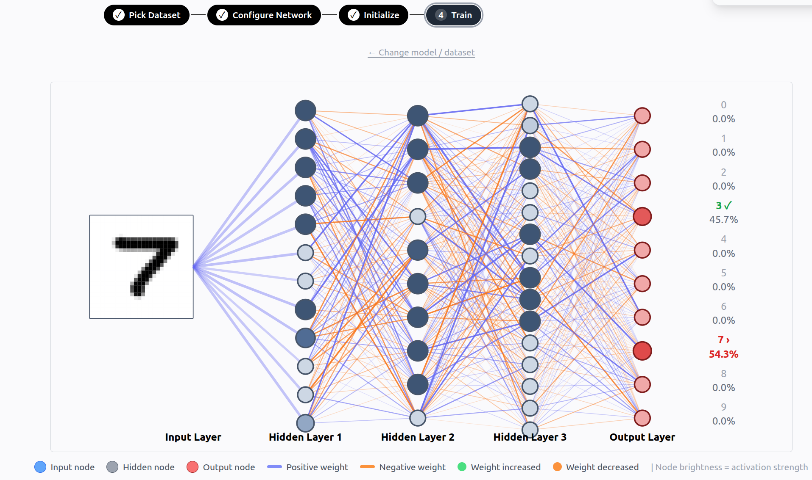
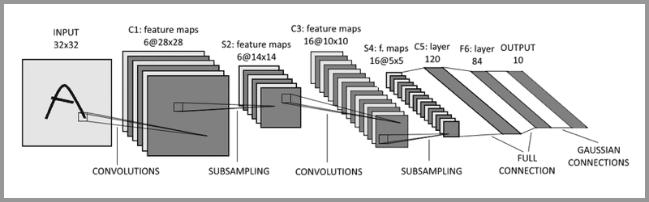
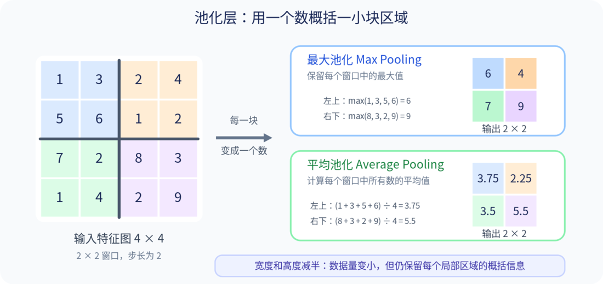

# 🤖 南科大 ARES 算法培训：机器学习与深度学习简介

> 讲解人：冯杰楠

## 👋 写在前面

机器学习和深度学习涉及编程、微积分、线性代数、概率统计、优化方法和大量工程实践。一次短时间的培训不可能让大家真正“学懂”它们，也没有必要塞入所有模型和公式。

这部分内容是一次 **introduction**：看看机器学习在研究什么、模型怎样从数据中学习，以及常见概念之间的关系。对于回归、MLP 和 CNN，我们关注“为什么出现”“大致做什么”“适合什么问题”，不展开完整的数学推导。

听完后不需要独立实现复杂模型，也不需要记住所有名词。如果你能够：

1. 对机器学习和深度学习正在解决的问题有一个基本认识；
2. 把常见概念放进一张大致的知识地图中，而不是只记住零散名词；
3. 判断自己是否对这个方向感兴趣；
4. 知道如果想继续学习，还需要补充哪些数学、编程和实践知识；

那么这次培训的目的就达到了。

## 🗺️ 先看一张知识地图

先看看机器学习和深度学习中经常出现的内容。现在不必记住所有名词，只需对这个领域的结构有一个印象。

```text
机器学习（Machine Learning）
├── 监督学习
│   ├── 回归：预测连续数值
│   └── 分类：预测所属类别
├── 无监督学习
│   ├── 聚类
│   └── 降维
└── 强化学习：状态、动作与奖励

深度学习（Deep Learning）
├── MLP：多层感知机
└── CNN：卷积神经网络
```

深度学习属于机器学习的一部分，MLP 和 CNN 都是常见的神经网络结构。本次培训会用回归介绍机器学习的基本思想，再简单认识这些深度学习模型。

## 🧠 机器学习和深度学习在干什么？

我们经常听到这样一句话：**机器学习就是在训练模型。**

在解释训练之前，我们先回答一个更基础的问题：**模型到底是什么？**

### 1. 模型就像一台加工机器

对模型最直观的理解，是把它想象成一台**加工机器**：我们把原料送进机器，机器经过加工，产出我们希望得到的结果。

```text
原料 → 加工机器 → 产品
```

把这个概念进一步抽象，就得到了大家熟悉的**函数**：原料是函数的输入，加工机器是函数本身，产品是函数的输出。

```text
原料      → 加工机器 → 产品
输入 x    → 模型 f   → 输出 ŷ
```

因此，模型可以理解为一个描述输入和输出关系的函数：

$$
\hat y=f(x)
$$

现实中的输入输出关系往往很复杂，数据中也可能包含噪声。训练得到的模型不是现实规律本身，而是对这种关系的一个**近似**：

> **模型训练，就是根据已有数据和选定的误差标准，寻找当前条件下最优的近似模型。**

这里的“最优”是指：**在选定的模型形式、已有数据和误差标准下表现最好。**

## 📈 线性回归：从数据中寻找一条直线

下面从大家高中接触过的**线性回归**开始。它是一种经典的监督学习方法：监督学习使用带标签的数据，回归和分类都属于这一类。

假设我们进行了 30 次实验，收集到 30 组输入 $x$ 和输出 $y$。数据整体上随 $x$ 增大而增大，但受测量误差等因素影响，并没有完全排成一条直线：



我们希望用一条直线近似描述 $x$ 和 $y$ 的关系：

$$
\hat y=wx+b
$$

对于第 $i$ 个数据点，真实值是 $y_i$，模型给出的预测值是 $\hat y_i$。二者之差叫作**残差**：

$$
e_i=y_i-\hat y_i
$$

图中的橙色虚线表示每个数据点的残差。为了衡量一条直线对全部数据的拟合效果，可以把所有残差平方后取平均，得到**均方误差**（Mean Squared Error，MSE）：

$$
\mathrm{MSE}=\frac{1}{n}\sum_{i=1}^{n}(y_i-\hat y_i)^2
$$

对残差取平方，一方面可以避免正负残差互相抵消，另一方面也会让较大的残差受到更明显的惩罚。

不同的 $w$ 和 $b$ 会得到不同的直线和 MSE。训练的目标就是寻找使 MSE 最小的 $w$ 和 $b$：

$$
\min_{w,b}\ \mathrm{MSE}
$$

这种通过最小化残差平方和拟合模型的方法叫作**最小二乘法**。求解最合适的 $w$ 和 $b$ 会用到多元函数求导和矩阵等知识，这里不展开。

在当前数据、线性模型和 MSE 评价标准下，图中的蓝线

$$
\hat y\approx1.00x+1.02
$$

就是这组数据的最佳拟合直线。

它不必经过每个数据点，只需较好地近似整体关系。训练后输入新的 $x$，就能得到预测值 $\hat y$；预测是否可靠仍取决于训练数据能否代表实际情况。

> **相关知识：**回归还涉及多元回归、极大似然估计、正则化和模型评价等内容。极大似然估计从概率角度理解参数选择，正则化则在拟合误差之外增加惩罚，这里不展开。

## 🧠 MLP：把简单函数组合成神经网络

线性回归使用一条直线近似输入和输出之间的关系，但现实中的关系往往不是线性的。为了描述更复杂的关系，我们可以把许多简单函数连接起来，组成一个更复杂的函数。MLP（Multi-Layer Perceptron，多层感知机）就是最基础的神经网络之一。

### 1. 从一个神经元开始

人工神经元受生物神经元启发，借用了“接收—处理—输出”的思路，但它只是高度简化的数学模型，并不是真正还原大脑。

一个神经元会接收上一层多个神经元的输出（第一层直接接收数据），汇总并进行非线性处理，再传给下一层：

```text
上一层神经元的输出 → 当前神经元进行处理 → 输出给下一层神经元
```



具体来说，神经元先把多个输入进行加权求和，再加上一个偏置：

$$
z=w_1x_1+w_2x_2+\cdots+w_nx_n+b
$$

也可以用求和符号简写为：

$$
z=\sum_{i=1}^{n}w_ix_i+b
$$

其中，$x_i$ 是第 $i$ 个输入，$w_i$ 是对应的权重，$b$ 是偏置。每个输入乘以自己的权重后相加，这和线性回归非常相似。

随后，$z$ 会经过一个**激活函数** $\sigma$ 进行非线性处理，得到神经元的输出：

$$
a=\sigma(z)
$$

因此，一个神经元仍是一台小型加工机器：接收输入，按照权重和偏置计算，再产生输出。

### 2. 从一个神经元到多层网络

把多个神经元并排放在一起，就组成了一层；再把多层依次连接起来，就得到了 MLP：



MLP 中相邻两层的神经元通常两两连接，因此也称为**全连接神经网络**。

前一层的输出会成为后一层的输入。中间的层叫作**隐藏层**，因为训练数据只告诉了我们原始输入和最终答案，并没有直接规定每个中间神经元应该表示什么。

### 3. 为什么需要激活函数？

如果每一层都只进行线性计算，那么无论连接多少层，最终仍然等价于一个线性函数。激活函数为网络加入了**非线性**，使 MLP 能够近似比直线复杂得多的输入输出关系。

下面是三种常见的激活函数：



- **Sigmoid**：把任意输入压缩到 0 和 1 之间，常用于表示二分类的输出概率。
- **Tanh**：把任意输入压缩到 -1 和 1 之间，并且以 0 为中心。
- **ReLU**：正数保持不变，负数变成 0，是现代神经网络隐藏层中常见的选择。

### 4. MLP 怎样学习？

MLP 仍是带参数的函数，参数是各层神经元的权重和偏置。训练就是调整这些参数，使预测误差尽可能小。

一次参数更新大致包含以下过程：



数据从输入层经过隐藏层得到预测，叫作**前向传播**；随后用损失函数衡量预测与正确答案的差距。

将每个参数对误差的影响从输出层向输入层逐层计算，就是**反向传播**（Backpropagation）。可以把它理解为：**把误差“责任”逐层传回去，判断参数应该怎样调整。**梯度下降等优化方法再利用这些信息更新参数，反复减小误差。

> 反向传播的严格推导会用到导数和链式法则，这里不展开数学细节。

> 🧪 **可视化体验：** [Neural Network Visualizer](https://www.nn-visual.com/) 可以配置并训练网络，观察前向传播、反向传播、权重更新和 Loss 的变化。

> 🎬 **推荐观看：** [3Blue1Brown《Backpropagation, intuitively》](https://www.youtube.com/watch?v=Ilg3gGewQ5U)，通过动画直观解释反向传播。

### 5. 从 MLP 到 CNN

MLP 是理解其他神经网络的起点。CNN 保留了“逐层组合带参数计算”的思路，也通过损失函数和反向传播训练。

CNN 不是 MLP 的简单变形，而是针对图像的空间结构，加入了局部连接和参数共享等设计。

### 6. 隐藏层到底学到了什么？

训练数据只规定最终输出，并不会要求某个神经元必须识别“横线”“圆形”或其他概念。网络会自行形成中间表示。



图中能看到不同神经元的激活程度和最终预测，但我们通常无法准确说明每个神经元提取了什么，也很难赋予它稳定的人类语义。可以确定的是，网络在逐层进行**特征提取和特征组合**。

> **虽然我们不知道每个神经元具体提取了什么，但我们知道，整个网络正在逐层提取并组合对任务有用的特征。**

## 👁️ CNN：让神经网络利用图像的空间结构

MLP 可以把图像像素排成长向量后处理，但没有充分利用**相邻像素之间的关系**。一条边缘由附近多个像素共同构成，无论它出现在哪里，我们都希望用相同方法找到它。CNN（Convolutional Neural Network，卷积神经网络）正是为利用这种空间结构而设计的。

### 1. 先看 CNN 的整体结构



上图是经典的 LeNet。C1 和 C3 是卷积层，S2 和 S4 是下采样层（可近似理解为池化层），后面的网络整合特征并输出 10 个数字类别的预测结果。

经典图像分类 CNN 会重复堆叠“卷积层—激活函数—池化层”，逐步得到更小但更抽象的特征图，最后通过分类头输出结果。

```text
输入图像 → [卷积层 → 激活函数 → 池化层] × 多次 → 分类头 → 预测结果
```

> 🧪 **卷积神经网示例：** [TensorSpace LeNet Playground](https://tensorspace.org/html/playground/lenet_zh.html) 可以输入手写数字，观察 LeNet 的分类结果和逐层处理过程。

### 2. 卷积层：用小窗口提取局部特征

CNN 的核心是**卷积层**。可以把卷积核理解成一张**特征比对卡**：它在图像上滑动，局部区域与它越匹配，输出特征图中对应位置的响应通常越强。


<div style="display: flex; justify-content: center; align-items: center; gap: 24px; flex-wrap: nowrap;">
  
  
</div>

这里有两个重要的直觉：

- **局部感受野**：卷积核窗口相当于局部视野，只关注窗口内的特征；
- **参数共享**：同一个卷积核在图像的不同位置重复使用，因此同一种特征出现在哪里都可以被检测，同时也大幅减少了参数数量。

一个卷积核会得到一张**特征图**（Feature Map）。一层通常使用多个卷积核，分别寻找不同的局部特征；产生的多张特征图会组成一个三阶张量，交给后续网络。

连续堆叠卷积层，可以把简单特征组合成更深层的特征，感受野也会逐渐扩大。浅层可能响应边缘、方向和纹理，深层则把它们组合成形状、部件和物体特征。

> 同样，这些特征是网络为了降低 Loss 自己学到的。我们可以观察特征图的响应，却不一定能准确说明每个卷积核或每张深层特征图到底代表什么。

### 3. 激活函数：逐个处理特征响应

卷积后通常接 ReLU 等激活函数，对特征图中的每个数值独立处理。以 ReLU 为例，正数保持不变，负数变为 0。因此，**卷积综合附近的信息，激活函数逐个处理得到的特征响应。**

### 4. 池化层：压缩特征图

**池化层**（Pooling Layer，也称汇聚层）主要负责对特征图进行下采样。它也会用一个小窗口滑过特征图，但不再做带参数的加权计算，而是直接取窗口中的最大值或平均值。



- **最大池化**（Max Pooling）：保留局部区域中最强的特征响应；
- **平均池化**（Average Pooling）：保留局部区域的平均响应。

池化会缩小特征图的宽和高，压缩信息并减少计算量。最大池化和平均池化没有可训练参数；现代 CNN 也可能用带步长的卷积下采样，并非必须包含池化层。

### 5. CNN 怎样学习？

CNN 改变的是**模型结构**，训练方法没有变。卷积核中的数值也是可学习参数，网络会通过反向传播自行调整，不必人工规定每个卷积核检测什么。

> **一句话概括：** CNN 通过在图像上重复使用小窗口，逐层提取并组合局部特征，适合处理图像等具有空间结构的数据。

## 🎯 总结：把所有模型放回同一条主线

从线性回归到 CNN，本质上都是**描述输入和输出关系的带参数函数**：

```text
输入数据 → 模型 → 预测结果 → 计算 Loss → 更新参数
                         ↑                 │
                         └──── 反复训练 ────┘
```

它们使用不同结构处理不同数据：

| 模型或机制 | 核心思路 | 适合处理的数据 |
|---|---|---|
| 线性回归 | 用一条直线近似输入和输出的关系 | 具有简单数值关系的数据 |
| MLP | 通过多层加权组合和非线性变换提取、组合特征 | 向量、表格等一般形式的数据 |
| CNN | 用卷积核在不同位置寻找局部特征，并逐层组合 | 图像等具有空间结构的数据 |

这些模型结构不同，但都通过数据、Loss 和反向传播学习参数。

结构复杂、参数很多不代表效果一定更好；效果还取决于数据、Loss 和模型在新数据上的表现。

这次培训的目标不是立即学会推导和训练复杂模型，而是建立概念地图：知道这些模型大致做什么、为何出现，并发现自己感兴趣的方向。继续深入还需要学习线性代数、微积分、概率统计、编程和具体模型。
